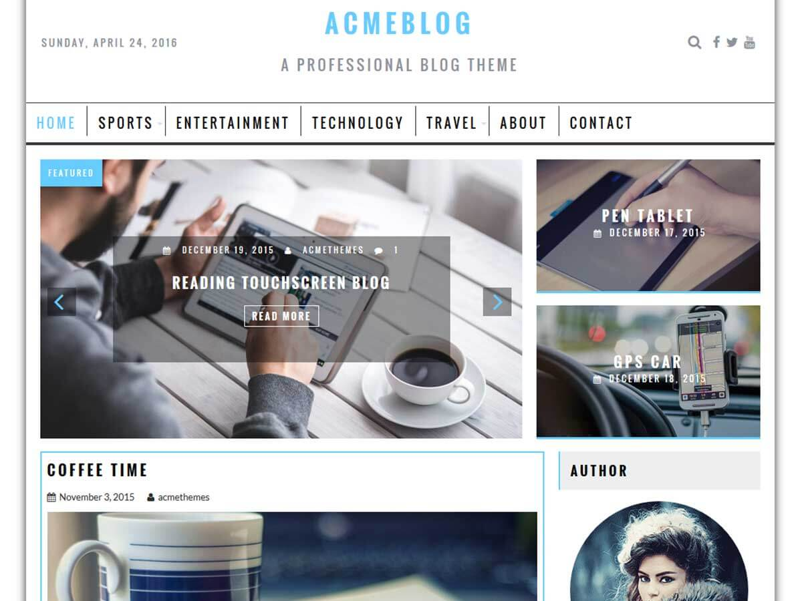

# AcmeBlog

**Contributors:** acmethemes  
**Requires at least:** 6.6  
**Tested up to:** 7.0  
**Requires PHP:** 7.4  
**Stable tag:** 4.0.0  
**License:** GPLv2 or later  
**License URI:** https://www.gnu.org/licenses/gpl-2.0.html  

> 

AcmeBlog is a professional blog theme built for writers, publishers, and content creators. Whether you run a personal blog, a news site, or an online magazine, AcmeBlog gives you a clean, lightweight foundation that puts your content front and center. It's SEO-friendly, responsive, and ready to go in minutes.

## Features

- **Two layout modes** — choose between full-width or boxed layout
- **Flexible sidebar** — left, right, or no sidebar per page
- **Customizable header** — logo, date display, search bar, and social icons
- **Featured section** — showcase your best content with full customizer control
- **Related posts** — show or hide related content below single posts
- **Breadcrumb navigation** — improve site structure and SEO
- **Custom background & colors** — match your brand with a single click
- **Author widget** — display author bios in the sidebar
- **Translation ready** — .pot file included
- **Image control** — enable/disable images on blog and archive pages
- **Footer copyright** — add your own copyright text
- **Reset options** — start fresh anytime

## Installation

1. Download the theme zip file.
2. In your WordPress admin, go to **Appearance → Themes**.
3. Click **Add New** → **Upload Theme**.
4. Select the zip file and click **Install Now**.
5. Click **Activate**.

## Frequently Asked Questions

### How do I set up the front page?

1. Create a new page in **Pages → Add New**.
2. Go to **Settings → Reading**.
3. Under "Front page displays," choose **A static page** and select your page.

### How do I customize the theme?

Go to **Appearance → Customize** — all theme options are available there, from layout to colors to featured content.

### What image sizes should I use?

Set your media sizes in **Settings → Media**:
- Thumbnail: 500 × 280 (cropped)
- Medium: 690 × 400
- Large: 1080 × 530

## Credits

AcmeBlog is built on [Underscores](https://underscores.me/) and licensed under GPLv2 or later. It bundles the following third-party resources:

- [Google Fonts](https://fonts.google.com/) — Apache License 2.0
- [Font Awesome](https://fontawesome.com/) — MIT / SIL OFL 1.1
- [normalize.css](https://necolas.github.io/normalize.css/) — MIT
- [BxSlider](https://bxslider.com/) — MIT
- [SlickNav](https://github.com/ComputerWolf/SlickNav) — MIT
- [Theia Sticky Sidebar](https://github.com/WeCodePixels/theia-sticky-sidebar) — MIT
- [Breadcrumb Trail](https://github.com/justintadlock/breadcrumb-trail) — GPLv2+
- [TGM Plugin Activation](http://tgmpluginactivation.com/) — GPLv2+
- [html5shiv](https://github.com/afarkas/html5shiv) — MIT
- [Respond.js](https://github.com/scottjehl/Respond) — MIT

---

[Demo](http://www.acmethemes.com/demo/?theme=acmeblog) &middot; [Support](https://www.acmethemes.com/supports/) &middot; [Acme Themes](https://www.acmethemes.com)
